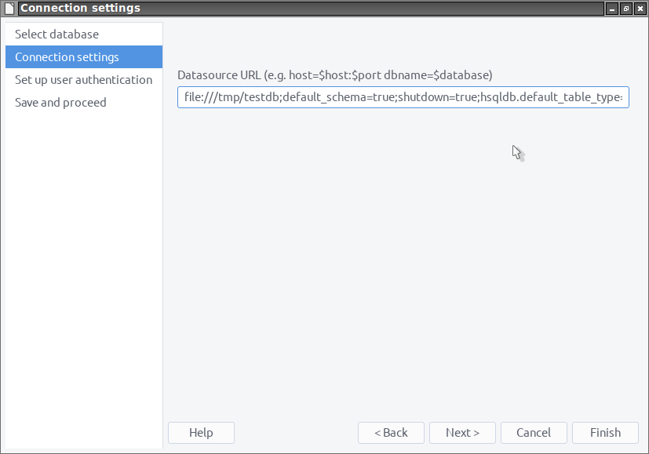

**Ce [document](https://prrvchr.github.io/HsqlDBDriverOOo/README_fr) en français.**

**The use of this software subjects you to our** [**Terms Of Use**](https://prrvchr.github.io/HsqlDBDriverOOo/HsqlDBDriverOOo/registration/TermsOfUse_en)

# version [0.0.2](https://prrvchr.github.io/HsqlDBDriverOOo#historical)

## Introduction:

**HsqlDBDriverOOo** is part of a [Suite](https://prrvchr.github.io/) of [LibreOffice](https://www.libreoffice.org/download/download/) and/or [OpenOffice](https://www.openoffice.org/download/index.html) extensions allowing to offer you innovative services in these office suites.  
This extension allows you to use the HsqlDB driver of your choice directly in Base.

Being free software I encourage you:
- To duplicate its [source code](https://github.com/prrvchr/HsqlDBDriverOOo).
- To make changes, corrections, improvements.
- To open [issue](https://github.com/prrvchr/HsqlDBDriverOOo/issues/new) if needed.

In short, to participate in the development of this extension.
Because it is together that we can make Free Software smarter.

## Requirement:

HsqlDB is a database written in Java.  
The use of HsqlDB requires the installation and configuration within  
LibreOffice / OpenOffice of a **JRE version 1.8 minimum** (ie: Java version 8)

Sometimes it may be necessary for LibreOffice users must have no HsqlDB driver installed with LibreOffice  
(check your Installed Application under Windows or your Packet Manager under Linux).  
~~It seems that version 7.x of LibreOffice has fixed this problem and is able to work with different driver version of HsqlDB simultaneously.~~  
After much testing it seems that LibreOffice (6.4.x and 7.x) cannot load a provided HsqlDB driver (hsqldb.jar v2.5.1), if the Embedded HsqlDB driver is installed (and even the solution is sometimes to rename the hsqldb.jar in /usr/share/java, uninstalling the libreoffice-sdbc-hsqldb package does not seem sufficient...)  
To overcome this limitation and if you want to use build-in Embedded HsqlDB, remove the build-in Embedded HsqlDB driver (hsqldb.jar v1.8.0) and install this extension: [HsqlDBembeddedOOo](https://prrvchr.github.io/HsqlDBembeddedOOo/) to replace the failing LibreOffice Embedded HsqlDB built-in driver.  
OpenOffice doesn't seem to need this workaround.

## Installation:

It seems important that the file was not renamed when it was downloaded.
If necessary, rename it before installing it.

- Install [HsqlDBDriverOOo.oxt](https://github.com/prrvchr/HsqlDBDriverOOo/raw/master/HsqlDBDriverOOo.oxt) extension version 0.0.2.

Restart LibreOffice / OpenOffice after installation.

## Use:

In LibreOffice / OpenOffice go to File -> New -> Database...:

In step: Select database:
- select: Connect to an existing database
- choose: HsqlDB Driver
- click on button: Next

In step: Connection settings:
- in Datasource URL put:
    - for Linux: file:///tmp/testdb;default_schema=true;shutdown=true;hsqldb.default_table_type=cached;get_column_name=false
    - for Windows: file:///c:/tmp/testdb;default_schema=true;shutdown=true;hsqldb.default_table_type=cached;get_column_name=false
- click on button: Next

In step: Set up user authentication:
- click on button: Test connection

If the connection was successful, you should see this dialog window:

Have fun...

## Has been tested with:

* OpenOffice 4.1.8 x86_64 - Ubuntu 20.04 - LxQt 0.14.1

* LibreOffice 6.4.4.2 (x64) - Windows 7 SP1

I encourage you in case of problem :-(  
to create an [issue](https://github.com/prrvchr/HsqlDBDriverOOo/issues/new)  
I will try to solve it ;-)

## Historical:

### What has been done for version 0.0.1:

- The writing of this driver was facilitated by a [discussion with Villeroy](https://forum.openoffice.org/en/forum/viewtopic.php?f=13&t=103912), on the OpenOffice forum, which I would like to thank, because knowledge is only worth if it is shared...

- Using the new version of HsqlDB 2.5.1.

- Many other fix...

### What remains to be done for version 0.0.1:

- Add new language for internationalization...

- Anything welcome...
