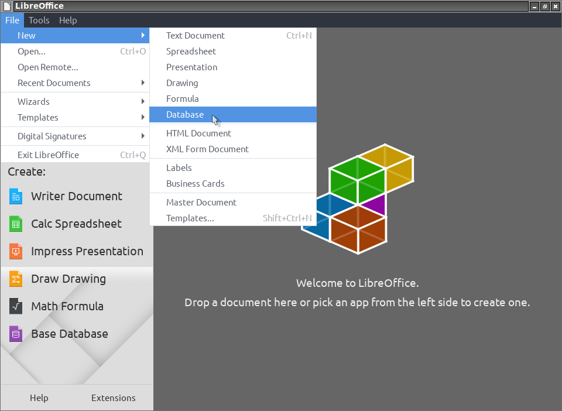
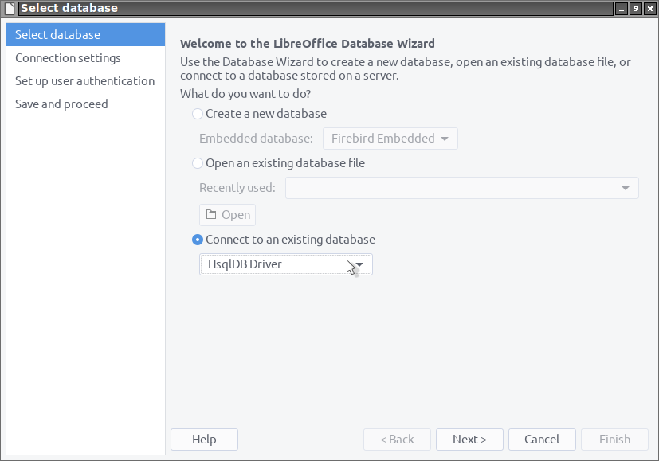

**This [document](https://prrvchr.github.io/HsqlDBDriverOOo) in English.**

**L'utilisation de ce logiciel vous soumet à nos** [**Conditions d'utilisation**](https://prrvchr.github.io/HsqlDBDriverOOo/HsqlDBDriverOOo/registration/TermsOfUse_fr)

# version [0.0.1](https://prrvchr.github.io/HsqlDBDriverOOo/README_fr#historique)

## Introduction:

**HsqlDBDriverOOo** fait partie d'une [Suite](https://prrvchr.github.io/README_fr) d'extensions [LibreOffice](https://fr.libreoffice.org/download/telecharger-libreoffice/) et/ou [OpenOffice](https://www.openoffice.org/fr/Telecharger/) permettant de vous offrir des services inovants dans ces suites bureautique.  
Cette extension vous permet d'utiliser le pilote HsqlDB de votre choix directement dans Base.

Etant un logiciel libre je vous encourage:
- A dupliquer son [code source](https://github.com/prrvchr/HsqlDBDriverOOo).
- A apporter des modifications, des corrections, des améliorations.
- D'ouvrir un [disfonctionnement](https://github.com/prrvchr/HsqlDBDriverOOo/issues/new) si nécessaire.

Bref, à participer au developpement de cette extension.
Car c'est ensemble que nous pouvons rendre le Logiciel Libre plus intelligent.

## Prérequis:

HsqlDB est une base de données écrite en Java.  
L'utilisation de HsqlDB nécessite l'installation et la configuration dans
LibreOffice / OpenOffice d'un **JRE version 1.8 minimum** (c'est-à-dire: Java version 8)

Parfois, il peut être nécessaire pour les utilisateurs de LibreOffice de ne pas avoir de pilote HsqlDB installé avec LibreOffice  
(vérifiez vos applications installées sous Windows ou votre gestionnaire de paquets sous Linux)  
Il semble que les versions 6.4.x et 7.x de LibreOffice aient résolu ce problème et sont capables de fonctionner simultanément avec différentes versions de pilote de Hsqldb.  
OpenOffice ne semble pas avoir besoin de cette solution de contournement.

## Installation:

Il semble important que le fichier n'ait pas été renommé lors de son téléchargement.  
Si nécessaire, renommez-le avant de l'installer.

- Installer l'extension [HsqlDBDriverOOo.oxt](https://github.com/prrvchr/HsqlDBDriverOOo/raw/master/HsqlDBDriverOOo.oxt) version 0.0.1.

Redémarrez LibreOffice / OpenOffice après l'installation.

## Utilisation:

Dans LibreOffice / OpenOffice aller à: Fichier -> Nouveau -> Base de données...:

A l'étape: Sélectionner une base de données:
- selectionner: Connecter une base de données existante
- choisir: Pilote HsqlDB
- cliquer sur le bouton: Suivant

A l'étape: Paramètres de connexion:
- dans URL de la source de données saisir:
    - pour Linux: file:///tmp/testdb;default_schema=true;shutdown=true;hsqldb.default_table_type=cached;get_column_name=false
    - pour Windows: file:///c:/tmp/testdb;default_schema=true;shutdown=true;hsqldb.default_table_type=cached;get_column_name=false
- cliquer sur le bouton: Suivant

A l'étape: Paramétrer l'authentification de l'utilisateur:
- cliquer sur le bouton: Tester la connexion

Si la connexion a réussi, vous devriez voir cette fenêtre de dialogue:

Maintenant à vous d'en profiter...

## A été testé avec:

* OpenOffice 4.1.8 x86_64 - Ubuntu 20.04 - LxQt 0.14.1

* LibreOffice 6.4.4.2 (x64) - Windows 7 SP1

Je vous encourage en cas de problème :-(  
de créer un [disfonctionnement](https://github.com/prrvchr/HsqlDBDriverOOo/issues/new)  
J'essaierai de le résoudre ;-)

## Historique:

### Ce qui a été fait pour la version 0.0.1:

- Utilisation de la nouvelle version de HsqlDB 2.5.1.

- Beaucoup d'autres correctifs...

### Que reste-t-il à faire pour la version 0.0.1:

- Ajouter de nouvelles langue pour l'internationalisation...

- Tout ce qui est bienvenu...
